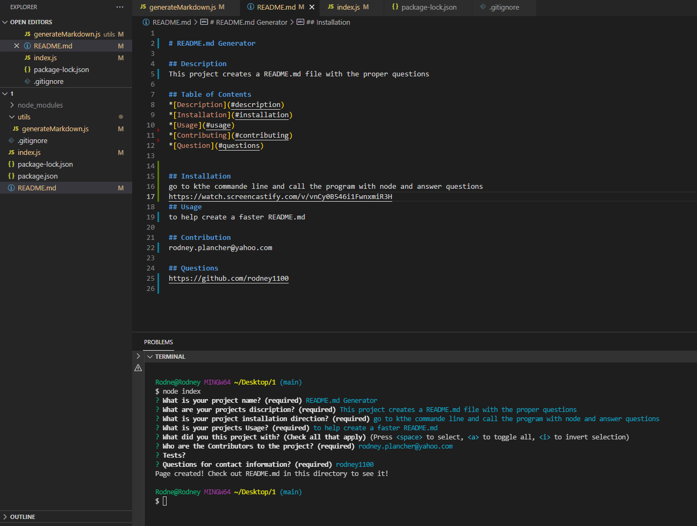

# README.md Generator

## Description
This project creates a README.md file with the proper questions

## Table of Contents
*[Description](#description) 
*[Installation](#installation) 
*[Usage](#usage) 
*[Contributing](#contributing) 
*[Question](#questions)

## Installation
go to kthe commande line and call the program with node and answer questions
https://watch.screencastify.com/v/vnCy0B546i1FwnxmiR3H
## Usage
to help create a faster README.md

## Contribution
rodney.plancher@yahoo.com

## Questions
https://github.com/rodney1100
